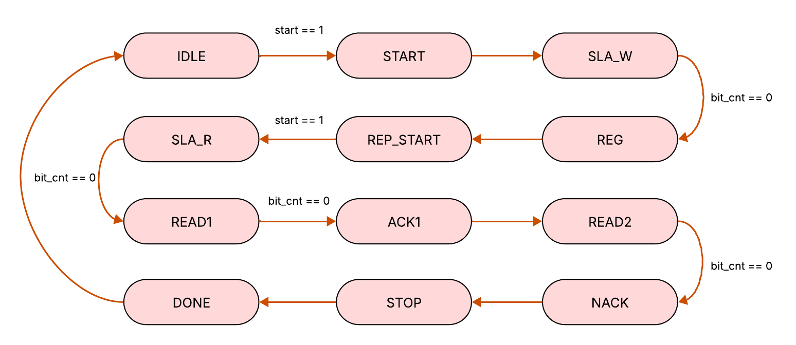
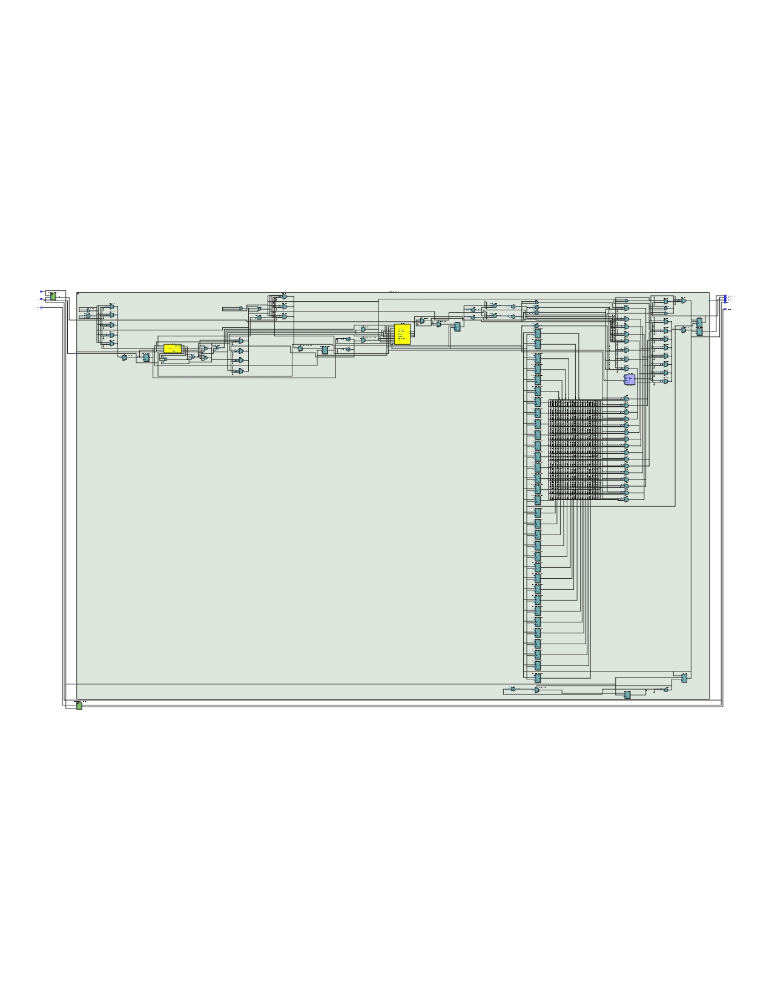
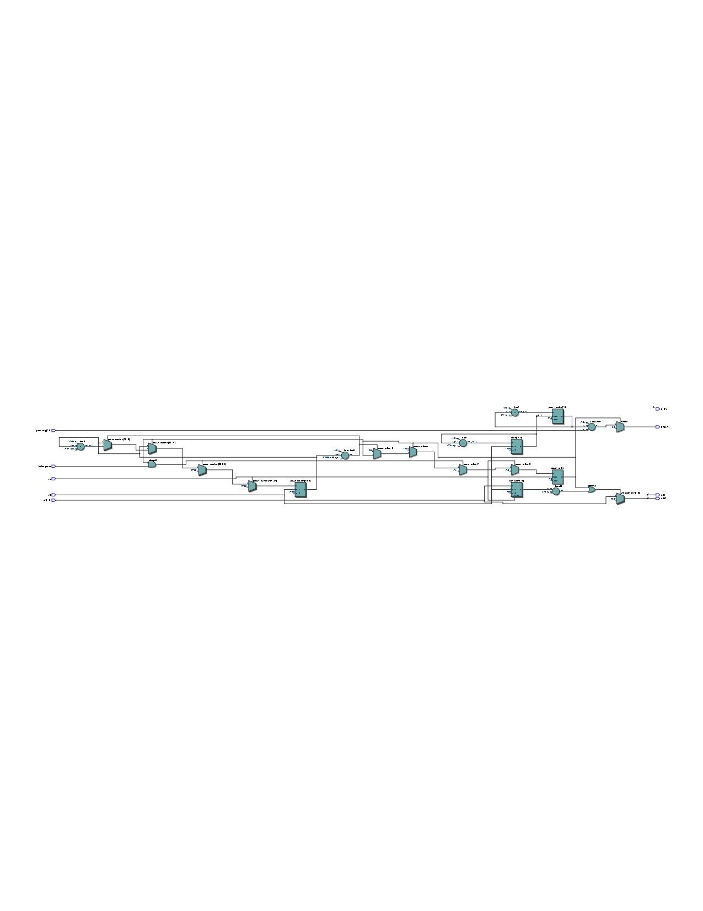
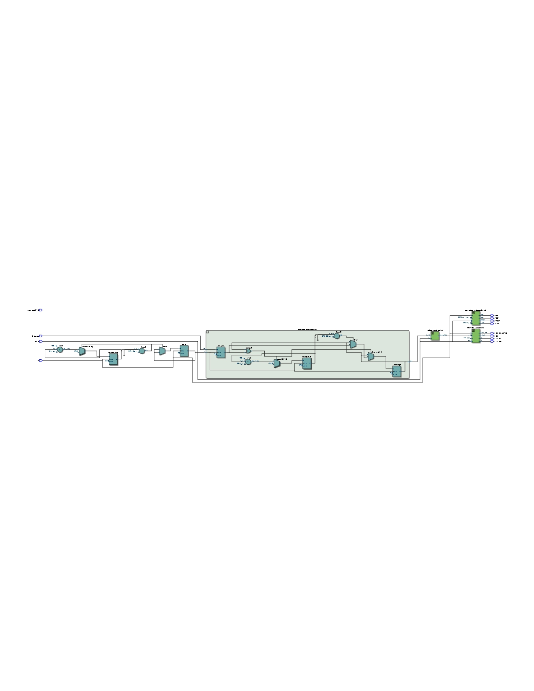
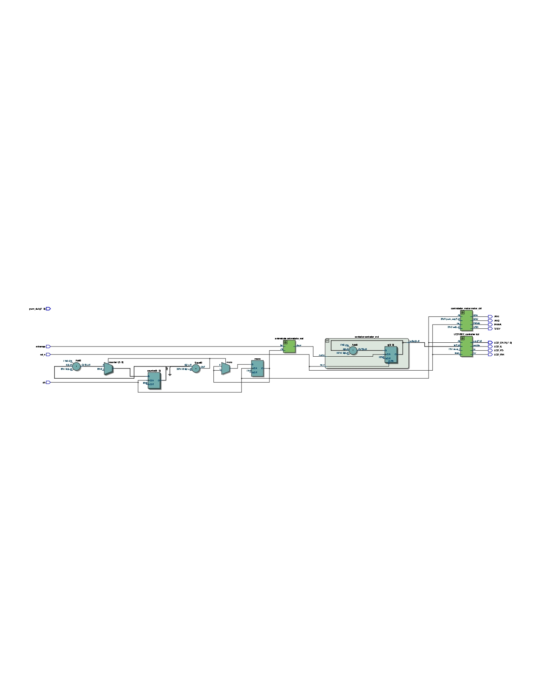
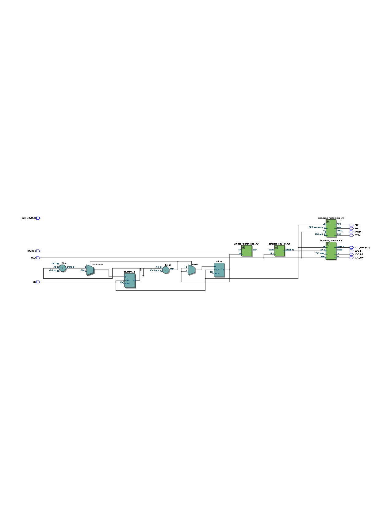

# Proyecto Final Electrónica Digital I SmartCount

# Integrantes
- [José Luis Pulido Fonseca](https://github.com/jpulidof)  
- [Nicolle Stefannie Ospina Pérez](https://github.com/stefannie4)
- [Ana María Orozco Reyes](https://github.com/anaor17)

# Informe

Indice:

1. [Diseño implementado](#diseño-implementado)
2. [Simulaciones](#simulaciones)
3. [Implementación](#implementación)
4. [Conclusiones](#conclusiones)
5. [Referencias](#referencias)

## Diseño implementado
El diseño implementado en este proyecto se basa en una banda transportadora sobre la cual se desplazan cubos que deben ser contados automáticamente. Para ello, se utiliza un sensor de ultrasonido que detecta la presencia de cada cubo al pasar por un punto específico de la banda. La señal generada por el sensor es procesada por una FPGA, que cumple la función de unidad de control central del sistema. La FPGA interpreta las señales, incrementa un contador y actualiza en tiempo real la cantidad de cubos detectados en una pantalla LCD. Esta integración permite una supervisión clara y precisa del proceso, asegurando la confiabilidad del sistema incluso a velocidades de transporte variables.

La elección de una FPGA como núcleo del sistema responde a la necesidad de contar con una plataforma flexible, reconfigurable y capaz de ejecutar múltiples tareas en paralelo, como la lectura del sensor, el procesamiento del conteo y el control de la visualización. El diseño modular implementado permite una fácil adaptación a otras aplicaciones similares en el ámbito industrial, donde se requiere automatizar procesos de conteo o clasificación. Además, la sincronización precisa entre los componentes garantiza un funcionamiento coordinado y eficiente. 

### Descripción
A continuación se presenta la descripción de cada módulo que compone el proyecto para cada uno de los elementos que lo componen:

#### Pantalla LCD
  
El módulo LCD1602_controller implementa un controlador para una pantalla LCD tipo 1602, permitiendo mostrar tanto texto estático como datos numéricos dinámicos. El controlador se basa en una máquina de estados finitos (FSM) que gestiona de forma secuencial la i0nicialización de la pantalla, la escritura de mensajes predefinidos en ambas líneas y la actualización periódica del contenido dinámico, como la cantidad de objetos contados. El texto estático se almacena en una memoria cargada desde archivo, mientras que los valores dinámicos se reciben como entrada (in) y se descomponen en centenas, decenas y unidades para su visualización en formato ASCII.

Para cumplir con los tiempos requeridos por la pantalla, el módulo emplea un divisor de frecuencia que genera pulsos cada 16 ms. A cada transición del pulso, se avanza en la FSM para enviar comandos o datos según el estado actual. La lógica de escritura dinámica permite mostrar números de hasta tres dígitos, usando una pequeña máquina de estados dentro del estado DYNAMIC_TEXT. Este diseño modular y parametrizable no solo cumple con los requerimientos de interfaz, sino que también permite adaptarse fácilmente a otros sistemas embebidos basados en FPGA que requieran salida visual clara y actualizable.

* Descripción de cada estado:
- IDLE:	Espera la señal ready_i. Se resetean los contadores.
- CONFIG_CMD1: Se envían comandos de inicialización desde config_mem.
- WR_STATIC_TEXT_1L: 	Se escribe la primera línea del mensaje estático desde static_data_mem.
- CONFIG_CMD2:	Se envía el comando para pasar a la segunda línea (START_2LINE).
- WR_STATIC_TEXT_2L:	Se escribe la segunda línea del mensaje estático.
- DYNAMIC_TEXT:	Se actualizan los tres dígitos del valor de entrada in (centena, decena, unidad), mostrando el número en ASCII. Avanza con flag_case.

#### Puente H

El módulo controlador_motor gestiona la activación, dirección y velocidad de un motor de corriente continua mediante señales de control y modulación por ancho de pulso (PWM), utilizando una arquitectura basada en lógica secuencial. El sistema opera en tres estados (IDLE, CLOCK_WISE y COUNTER_CLOCK_WISE), definidos por la señal de entrada sel, y emplea una máquina de estados finitos (FSM) sencilla para controlar la dirección del motor a través de las señales AIN1 y AIN2. Además, incorpora una función de pausa temporal activada mediante el pulsador boton_pausa, la cual detiene el motor durante aproximadamente 2 segundos utilizando un contador sincronizado al reloj de 50 MHz, desactivando la señal PWM durante ese intervalo como medida de seguridad o control manual. La señal PWMA, que regula la velocidad del motor, se genera con una frecuencia cercana a 24 kHz mediante un divisor de reloj, y su ciclo de trabajo (duty cycle) se ajusta dinámicamente mediante la entrada pwm_duty. Esta implementación permite un control eficiente y flexible del motor en aplicaciones de automatización basadas en FPGA.

* Descripción de cada estado:
- IDLE: El motor está detenido sin movimiento. Es el estado inicial tras un reinicio (reset).
- CLOCK_WISE: El motor gira en sentido horario. La corriente fluye del terminal A al B del motor.
- COUNTER_CLOCK_WISE: El motor gira en sentido antihorario.
- PROTECTION (pausa activa): El motor se detiene temporalmente por seguridad o por pulsación del botón, sin importar el valor de sel.

#### Sensor infrarrojo
El módulo top_ultrasonic funciona como la unidad principal de integración del sistema. Se encarga de contar los eventos generados por el sensor de infrarrojo y mostrar dicho conteo en la pantalla LCD, además de gestionar la integración del motor dentro del sistema. Para cumplir con estas funciones, instancia varios módulos previamente descritos: antirrebote, que filtra la señal proveniente del sensor infrarrojo; contador, que registra el número de eventos detectados; LCD1602_controller, encargado de mostrar el valor del contador en la pantalla LCD; y controlador_motor, que determina el sentido de giro, la activación y la velocidad del motor. En conjunto, este módulo coordina la interacción entre las distintas partes del sistema, asegurando un funcionamiento sincronizado y confiable.

#### Otros módulos

Adicionalmente, para completar el sistema fue necesario incluir otros módelos además de los encargados de cada sensor, los cuales se presentan a continuación:

- Circuito antirebote: Un circuito antirrebote es un sistema diseñado para eliminar las lecturas erróneas causadas por los rebotes eléctricos que se producen cuando una señal digital cambia de estado, como ocurre comúnmente con botones o entradas mecánicas. En el contexto de un sensor de infrarrojo, el antirrebote se aplica típicamente a la señal de entrada del pin out, que indica la detección de un objeto. Si esta señal presenta fluctuaciones rápidas o inestables debido a interferencias o ruido, el sistema podría interpretar múltiples detecciones falsas o medir distancias incorrectas. El circuito antirrebote sincroniza esta señal con el reloj del sistema y verifica que el cambio de estado se mantenga constante durante un tiempo mínimo antes de considerarlo válido. De esta manera, se asegura que solo se registren transiciones reales y estables, mejorando la precisión y confiabilidad de la medición del sensor infrarrojo.
  
- Contador: El módulo contador implementa un contador ascendente de 10 bits, lo que le permite contar hasta un valor máximo de 1023. Su valor se incrementa cuando se detecta un flanco de subida en la señal de entrada cuenta. A diferencia de los contadores tradicionales, no utiliza el reloj principal de la FPGA como señal de sincronización, ya que su propósito específico es contar los objetos detectados por el sensor ultrasónico, reaccionando únicamente a los eventos generados por dicho sensor.

#### Protocolo I2C
A lo largo del proyecto se consideró la opción de realizar una clasificación de los objetos contados por color, por lo que se realizó el intento de implementar un sensor de color TCS34725, al trabajar en esto se presentó la necesidad de crear un módulo que implementara un protocolo I2C en la FPGA ya que esta no cuenta con este. El protocolo I2C (Inter-Integrated Circuit) permite la comunicación entre varios dispositivos, un Maestro (Encargado de iniciar y controlar la comunicación) y uno o varios esclavos (Responde a las órdenes del maestro). Para esto se utilizan dos líneas, una de reloj (SCL) y otra de datos (SDA), que permiten determina el inicio (con SDA = 0 y SCL = 1) y el final (con SDA = 1 y SCL = 1, por parte del maestro para realizar el envío de los bits. Para cada bit enviado, el esclavo debe generar una repuesta utilizando SDA, que indica reconocimiento de la información.

Debido a que la FPGA no cuenta con el protocolo, se procedió a crear el módulo i2c_master_read2bytes. 
* Entradas del módulo:
  - clk: El el reloj del sistema.
  - rst: Señal de reset.
  - start: Señal que inicia la comunicación I2C.
  - dev_addr [6:0]: Dirección del esclavo.
  - reg_addr [7:0]: Dirección del registro dentro del esclavo del que se leerán los datos.
 
* Salidas del módulo:
  - data_out [15:0]: Entregas los datos recibidos.
  - busy: Indica que una operación está en proceso.
  - done: Indica que no se está realizando ninguna operación.
  El modulo cuenta con un divisor que permite utilizar un reloj más lento y compatible con I2C que el de la FPGA.

* Descripción de cada estado:
  - IDLE: Estado inicial, se encarga de resetear las flags.
  - START: Inicia la comunicación.
  - SLA_W: Envía la dirección del esclavo con el bit de escritura.
  - REG: Envía el registro del esclavo del cual se leerán los datos.
  - REP_START: Cracterística del protocolo I2C que permite cambiar la operación de lectura a escritura.
  - SLA_R: Envía la dirección del esclavo con bit de lectura.
  - READ1: Lee el primer byte de información.
  - ACK1:	Envía ACK (reconocimiento) al esclavo, lo que permite identificar que se ha leído el primer bit está listo para continuar con el siguiente.
  - READ2: Lee el segundo byte de información.
  - NACK: Indica que se recibió la información y termina la lectura.
  - STOP: Detiene la comunicación.
  - DONE: Entrega una salida con los datos y regresa al estado inicial.
  
 Sin embargo, debido a complicaciones con ila implementación del sensor de color, este módulo no es utilizado en la presentación final del proyecto. Sin embargo se espera que sea utilizado en futuras mejoras del proyecto, para implementar la clasificación de objetos.

## Simulaciones 

<!-- (Incluir las de Digital si hicieron uso de esta herramienta, pero también deben incluir simulaciones realizadas usando un simulador HDL como por ejemplo Icarus Verilog + GTKwave) -->
A continuación se muestra la simulación del circuito antirrebote, se observan las entradas btn (entrada que se filtra) y clk (reloj), también muestra la señal btn_sync que estásincronizada con el reloj y la cuenta (count) que se realiza si en el flanco de subida del reloj y cuenta la duración de del pulso, el contador se reinicia cuando se lee un valor de btn_sync de cero.

A continuación se presenta la simulación del contador, el cual posee las entradas rst_n, que es un reset que se activa al estar en 0, además de cuanta, que la señal a la cual se le realiza conteo de sus pulsos. También se muestra el comportamiento de la señal q, que es la que se presenta a la salida y representa el valor actual del registro, mientras que la señal d es el estado futuro de la cuenta.

En la simulación de motor se observa el comportamientop de las variables que definen su funcionamiento, como el sentido de giro (AIN1, AIN2, CLOCK_WISE y COUNTER_CLOCK_WISE).

En el diagrama de simulación correspondiente a la LCD, se observa el cambio de la variable ready_i que permite al sistema salir del estado icicial y pasar al de configuración del LCD. También se puede observar el valor de las variables que indican la cantidad de bits que son enviados (DATA_BITS, NUM_DATA_ALL, NUM_DATA_PERLINE).

## Implementación

El proyecto se enfocó en el desarrollo de un sistema automatizado, basado en FPGA, para el conteo de cubos que se desplazaban sobre una banda transportadora. Para detectar cada elemento, se utilizó un sensor infrarrojo cuya señal fue procesada por la FPGA. Esta actuó como unidad de control, incrementando un contador y mostrando en una pantalla LCD el número total de cubos detectados en tiempo real. El diseño permitió mantener un funcionamiento confiable y se realizador pruebas para definir la velocidad más conveniente para el motor, y su estructura modular ofrece la posibilidad de adaptarlo fácilmente a otras aplicaciones industriales que requieran tareas similares de conteo o clasificación.

Se optó por emplear una FPGA debido a su capacidad de ejecutar varias operaciones en paralelo, lo que facilitó la integración de la lectura del sensor, el procesamiento del conteo y el control de la visualización. Esta característica, sumada a su flexibilidad y posibilidad de reconfiguración, hizo que el sistema resultara eficiente y escalable.

Como complemento, se implementó un circuito antirrebote destinado a mejorar la estabilidad de la señal proveniente del pin out del sensor infrarrojo. Gracias a este filtrado, se evitaron lecturas falsas ocasionadas por fluctuaciones o interferencias, lo que contribuyó a aumentar la precisión y la confiabilidad de las mediciones obtenidas.

 
## Anexos

## Conclusiones
  - El proyecto permitió aplicar el concepto de máquinas de estados finitos en un caso real de automatización, reforzando nuestra comprensión de este modelo computacional y su implementación en hardware programable.
    
 - La implementación del sensor TCS34725 con el protocolo I2C en la FPGA presentó desafíos inesperados, principalmente por la inestabilidad en la comunicación y desconocimiento del manejo del mismo. Aunque se resolvió posteriormente con un sensor infrarojo, evidenció que protocolos "sencillos" como I2C requieren diseño cuidadoso . Este problema retrasó el desarrollo, pero dejó lecciones valiosas para futuras integraciones de sensores.

  - Este proyecto demostró que se pueden crear sistemas de automatización accesibles para pequeñas empresas usando FPGAs, tal como planeamos al principio. Aunque tuvimos problemas para conectar algunos componentes, el sistema aunque no funciona en su totalidad, cumple con lo propuesto. Lo más valioso fue aprender resolviendo desafíos reales, que es justo lo que buscábamos con este trabajo.
